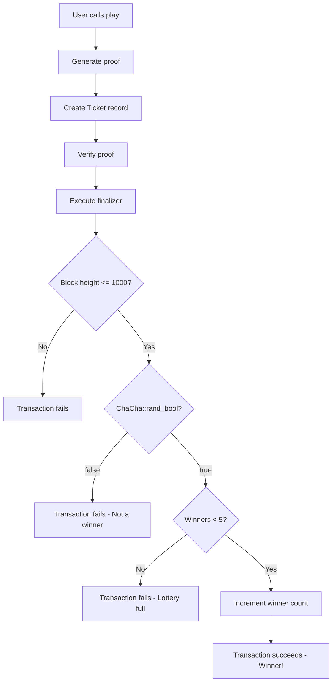

## Overview

The Lottery example demonstrates how to implement a simple lottery system using cryptographically secure randomness, time-based constraints, and on-chain state management. This is the simplest of the three main examples, making it perfect for learning finalizers.

<Info>
This example is located at `.circleci/lottery/` in the Leo repository and is actively tested in CI.
</Info>

## Program Structure

```leo
program lottery.aleo {
    mapping num_winners: u8 => u8;
    
    record Ticket {
        owner: address,
    }
    
    fn play() -> (Ticket, Final)
}

final fn finalize_play()
```

Despite its simplicity (~30 lines), this example demonstrates several important Leo concepts.

## Data Structures

### Mapping: Winner Count

Tracks the number of winners on-chain:

```leo
mapping num_winners: u8 => u8;
```

**Structure:**
- Key: `u8` (always `0u8` in this example)
- Value: `u8` (number of winners so far)

**Why use a mapping?**
Mappings provide persistent on-chain storage that survives across transactions. The winner count needs to be tracked globally.

### Record: Ticket

Represents a lottery ticket:

```leo
record Ticket {
    owner: address,
}
```

**Properties:**
- Private by default (encrypted on-chain)
- Only contains the owner's address
- Returned to the player when they play

<Note>
The ticket itself doesn't indicate whether it's a winning ticket. The winner is determined during finalization.
</Note>

## Core Function

### Playing the Lottery

```leo
fn play() -> (Ticket, Final) {
    let ticket: Ticket = Ticket {
        owner: self.caller,
    };
    return (ticket, final { finalize_play() });
}
```

**How it works:**
1. Creates a new ticket record
2. Sets the owner to `self.caller` (the transaction initiator)
3. Returns the ticket and a finalizer

**Parameters:** None - anyone can play!

**Returns:**
- `Ticket`: The lottery ticket (private record)
- `Final`: Deferred computation that executes on-chain

**Usage:**
```bash
leo run play
```

## Finalizer Logic

```leo
final fn finalize_play() {
    // Check that the lottery has not expired
    assert(block.height <= 1000u32);
    
    // Randomly select whether or not the ticket is a winner
    assert(ChaCha::rand_bool());
    
    // Check that the maximum number of winners have not been reached
    let winners: u8 = num_winners.get_or_use(0u8, 0u8);
    assert(winners < 5u8);
    num_winners.set(0u8, winners + 1u8);
}
```

### Step-by-Step Breakdown

#### 1. Expiration Check

```leo
assert(block.height <= 1000u32);
```

**Purpose:** Ensure the lottery hasn't expired.

**How it works:**
- `block.height` is the current block number
- If the current block is beyond 1000, the assertion fails
- The transaction is rejected

**Key Concept: Block Height**
`block.height` is only available in finalizer functions (not in regular functions). It represents the blockchain's current block number.

<Info>
In production, you'd set this to a reasonable future block height. Block 1000 is just for demonstration.
</Info>

#### 2. Random Winner Selection

```leo
assert(ChaCha::rand_bool());
```

**Purpose:** Randomly determine if the ticket is a winner.

**How it works:**
- `ChaCha::rand_bool()` generates a random boolean (true/false)
- If `true`: The ticket wins (assertion passes)
- If `false`: The ticket loses (assertion fails, transaction rejected)

**Odds:** Approximately 50% chance of winning.

<Warning>
This means roughly half of all play transactions will fail! In production, you might want different odds or handle losers more gracefully.
</Warning>

**Key Concept: ChaCha RNG**

The ChaCha random number generator provides cryptographically secure randomness based on the transaction's randomness seed.

**Properties:**
- Deterministic: Same seed always produces same result
- Unpredictable: Seed is derived from blockchain state
- Verifiable: Anyone can verify the randomness was fair

#### 3. Winner Limit Check

```leo
let winners: u8 = num_winners.get_or_use(0u8, 0u8);
assert(winners < 5u8);
```

**Purpose:** Limit the lottery to 5 winners maximum.

**How it works:**
- `num_winners.get_or_use(0u8, 0u8)` reads the current winner count
- If the key doesn't exist, returns `0u8` (default)
- Asserts that we have fewer than 5 winners
- If we already have 5 winners, the assertion fails

#### 4. Increment Winner Count

```leo
num_winners.set(0u8, winners + 1u8);
```

**Purpose:** Record that we have a new winner.

**How it works:**
- Adds 1 to the winner count
- Stores the updated count on-chain
- This change is permanent and visible to all future transactions

## Execution Flow

Here's what happens when someone plays:



## Running the Example

### Build the Program

```bash
cd .circleci/lottery
leo build
```

### Play the Lottery

```bash
leo run play
```

**Possible Outcomes:**

1. **Success (Winner!):**
   ```
   Ticket { owner: aleo1... }
   Winner count: 1
   ```

2. **Failure (Not a winner):**
   ```
   Error: Assertion failed in finalize_play
   (ChaCha::rand_bool() returned false)
   ```

3. **Failure (Lottery expired):**
   ```
   Error: Assertion failed in finalize_play
   (block.height > 1000u32)
   ```

4. **Failure (Lottery full):**
   ```
   Error: Assertion failed in finalize_play
   (winners >= 5u8)
   ```

### Use the Demo Script

```bash
./run.sh
```

## Key Concepts

### Finalizers vs Regular Functions

| Feature | Regular Function | Finalizer |
|---------|-----------------|----------|
| Execution | During proof generation (off-chain) | After proof verification (on-chain) |
| Access to mappings | No | Yes (read and write) |
| Access to `block.height` | No | Yes |
| Can fail after proof? | No | Yes (via assertions) |
| Visibility | Private computation | Public execution |

### Why Use a Finalizer?

In this example, the finalizer is essential because:

1. **Randomness**: `ChaCha::rand_bool()` must be deterministic during proving
2. **State**: Reading and writing the winner count requires on-chain access
3. **Time**: Checking `block.height` requires on-chain context

### Transaction Failures

<Warning>
If any assertion in the finalizer fails, the entire transaction is rejected, including the proof generation work!
</Warning>

This means:
- Players who lose don't get a ticket
- Players pay gas fees even if they lose
- The winner count only increments for actual winners

## Customization Ideas

### Adjust Winning Odds

```leo
final fn finalize_play() {
    // 10% chance to win
    let random: u8 = ChaCha::rand_u8();
    assert(random < 26u8);  // 26/256 ≈ 10%
    
    // ... rest of logic
}
```

### Change Expiration

```leo
final fn finalize_play() {
    // Expire after block 100,000
    assert(block.height <= 100000u32);
    
    // ... rest of logic
}
```

### Multiple Prize Tiers

```leo
record Ticket {
    owner: address,
    prize_tier: u8,  // 1 = grand prize, 2 = second prize, etc.
}

fn play() -> (Ticket, Final) {
    let ticket: Ticket = Ticket {
        owner: self.caller,
        prize_tier: 0u8,  // Determined in finalizer
    };
    return (ticket, final { finalize_play() });
}

final fn finalize_play() {
    assert(block.height <= 1000u32);
    
    let random: u8 = ChaCha::rand_u8();
    if random < 10u8 {
        // Grand prize - 10/256 chance
        let grand_winners: u8 = Mapping::get_or_use(num_winners, 1u8, 0u8);
        assert(grand_winners < 1u8);
        Mapping::set(num_winners, 1u8, grand_winners + 1u8);
    } else if random < 50u8 {
        // Second prize - 40/256 chance
        let second_winners: u8 = Mapping::get_or_use(num_winners, 2u8, 0u8);
        assert(second_winners < 10u8);
        Mapping::set(num_winners, 2u8, second_winners + 1u8);
    } else {
        // No prize
        assert(false);
    }
}
```

### Paid Entry Fee

Combine with the token example:

```leo
record Token {
    owner: address,
    amount: u64,
}

fn play(entry_fee: Token) -> (Ticket, Token, Final) {
    assert(entry_fee.amount >= 10u64);
    
    let change: Token = Token {
        owner: self.caller,
        amount: entry_fee.amount - 10u64,
    };
    
    let ticket: Ticket = Ticket {
        owner: self.caller,
    };
    
    return (ticket, change, final { finalize_play() });
}
```

## Testing

### Create Test Inputs

Create `inputs/lottery.in`:

```
[play]
```

### Run Tests

```bash
leo test
```

<Note>
Because the lottery uses randomness, tests may pass or fail randomly. In production tests, you'd want deterministic behavior.
</Note>

## Security Considerations

### Randomness Manipulation

<Warning>
The randomness is derived from the transaction's seed. While cryptographically secure, it's important to understand that it's deterministic and verifiable.
</Warning>

**Implications:**
- Players cannot manipulate randomness
- Validators cannot manipulate randomness
- Everyone can verify the randomness was fair

### Block Height Gaming

Players could potentially wait for a specific block height if they believe it affects their odds. In this example, it doesn't matter since randomness is based on the transaction seed, not block height.

### Winner Limit

The 5-winner limit is arbitrary. In production:
- Consider time-based resets
- Or periodic "rounds" with separate mappings
- Or dynamic limits based on entry fees

## Related Examples

<CardGroup cols={2}>
  <Card title="Token" icon="coins" href="/examples/token">
    Add paid entry fees
  </Card>
  <Card title="Tic-Tac-Toe" icon="grid" href="/examples/tictactoe">
    More complex state management
  </Card>
</CardGroup>

## Further Reading

<CardGroup cols={2}>
  <Card title="Finalize" icon="check-circle" href="/language/finalize">
    Deep dive into finalize blocks
  </Card>
  <Card title="Mappings" icon="database" href="/language/mappings">
    On-chain storage guide
  </Card>
  <Card title="Records" icon="lock" href="/language/records">
    Private data structures
  </Card>
  <Card title="Standard Library" icon="toolbox" href="/reference/standard-library">
    ChaCha RNG and more
  </Card>
</CardGroup>
